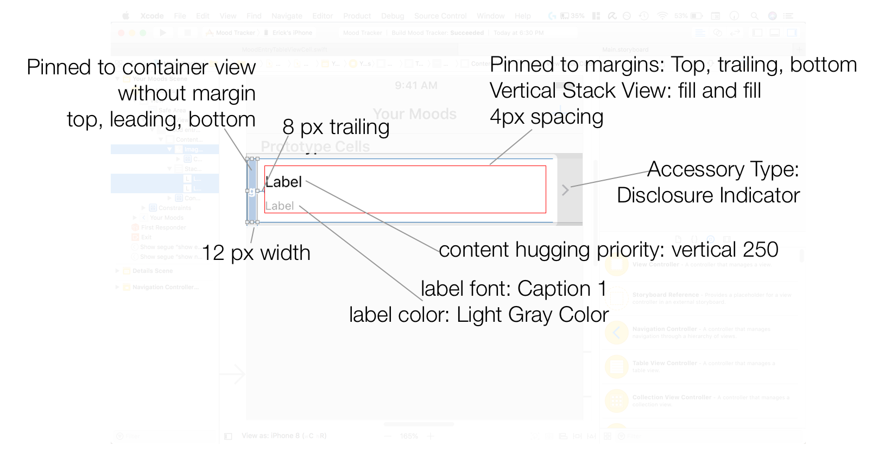

# Some Sample Clone App - Part 1 - Displaying Lists
## Collections
#### Create the MoodEntry Struct
1. Create `struct MoodEntry`
```swift
struct MoodEntry {
    var mood: Mood
    var date: Date

}
```
2. Add the `enum Mood: Int { ... }` inside the `MoodEntry` struct. This enum will have an `Int` as its `rawValue`
```swift
struct MoodEntry {
    ...
    enum Mood: Int {
        case none
        case amazing
        case good
        case neutral
        case bad
        case terrible
	  }
}
```
3. Add the computed `var stringValue: String` and return the appropriate string value for each `case` using a `switch statement`
```swift
enum Mood: Int {
    ...
    var stringValue: String {
        switch self {
        case .none:
            return ""
        case .amazing:
            return "Amazing"
        case .good:
            return "Good"
        case .neutral:
            return "Neutral"
        case .bad:
            return "Bad"
        case .terrible:
            return "Terrible"
        }
    }
}
```
4. Add a computed `var colorValue: UIColor` and return  the appropriate string value for each `case` using a `switch statement`. *note* be sure to add `import UIKit.UIColor` at the top of the file
```swift
import UIKit.UIColor // <- be sure to add `import UIKit.UIColor` at the top of the file

struct MoodEntry {
		...
		enum Mood: Int {
		    ...
		    var colorValue: UIColor {
		        switch self {
		        case .none:
		            return .clear
		        case .amazing:
		            return .green
		        case .good:
		            return .blue
		        case .neutral:
		            return .gray
		        case .bad:
		            return .orange
		        case .terrible:
		            return .red
		        }
		    }
		}
}
```
5. In the `ViewController.swift` add an empty array of entries
```swift
class ViewController: UIViewController {
    var entries: [MoodEntry] = []
}
```
#### Setting up the storyboard with a Table View
1. Add a `UITableView` and pin all edges to the view. This includes the *safe area*
2. Add one prototype cell and use the *subtitle* type for the *cell style*.  Set the *cell identifier* to  `mood entry cell`
## What is a datasource and a delegate?
#### Conforming the `ViewController` to the `UITableViewDataSource` methods
1. Create an `extension ViewController: UITableViewDataSource, UITableViewDelegate { ... }` in the `ViewController.swift` file and conform to the protocol by adding the following:
```swift
...
extension ViewController: UITableViewDataSource, UITableViewDelegate {

    func tableView(_ tableView: UITableView, numberOfRowsInSection section: Int) -> Int {
        return entries.count
    }

    func tableView(_ tableView: UITableView, cellForRowAt indexPath: IndexPath) -> UITableViewCell {
        let cell = tableView.dequeueReusableCell(withIdentifier: "mood entry cell", for: indexPath)

        let entry = entries[indexPath.row]
        cell.textLabel?.text = entry.mood.stringValue
        cell.detailTextLabel?.text = String(describing: entry.date)

        return cell
    }
}
```
2. In the storyboard, assign the `UITableView`’s `dataSource` and `delegate` to the `ViewController` class
#### Populating the table view with dummy data
1. Create an `IBOutlet` to the `ViewController` named *tableView*
2. In `viewDidLoad()` update the array of entries with dummy data and reload the table view
```swift
class ViewController: UIViewController {
    var entries: [MoodEntry] = []

    @IBOutlet weak var tableView: UITableView!

    override func viewDidLoad() {
        super.viewDidLoad()

        let goodEntry = MoodEntry(mood: .good, date: Date())
        let badEntry = MoodEntry(mood: .bad, date: Date())
        let neutralEntry = MoodEntry(mood: .neutral, date: Date())

        entries = [goodEntry, badEntry, neutralEntry]
		  tableView.reloadData()
    }
}
...
```
::run-able state: display the rows of entries and their details::
## Cont. Using UITableView to display a list of data
#### Create custom table view cell
1. In the storyboard, remove the subtitle cell and add a new `Prototype Cell` with the *cell style* to *custom*
	1. height of `72`
	2. the identifier of `mood entry cell`
	3. Accessory type: Disclosure Indicator
2. Add two labels and an image view in the cell as followed:

3. Create a subclass of `UITableViewCell` named `MoodEntryTableViewCell` and update the class in the `Identity Inspector` of the UITableViewCell in the storyboard
4. In `MoodEntryTableViewCell` class, create `IBOutlet`s for the each ui component
```swift
class MoodEntryTableViewCell: UITableViewCell {

    @IBOutlet weak var labelMoodTitle: UILabel!
    @IBOutlet weak var labelMoodDate: UILabel!
    @IBOutlet weak var imageViewMoodColor: UIImageView!

}
```
5. Update the `tableView(tableView: cellForRowAt:) -> UITableViewCell` in the `ViewController.swift` to use our custom cell
```swift
...
extension ViewController: UITableViewDataSource, UITableViewDelegate {
		...
	    func tableView(_ tableView: UITableView, cellForRowAt indexPath: IndexPath) -> UITableViewCell {
        let cell = tableView.dequeueReusableCell(withIdentifier: "mood entry cell", for: indexPath) as! MoodEntryTableViewCell

        let entry = entries[indexPath.row]
        cell.labelMoodTitle.text = entry.mood.stringValue
        cell.imageViewMoodColor.backgroundColor = entry.mood.colorValue
        cell.labelMoodDate.text = String(describing: entry.date)

        return cell
    }
}
```
::run-able state: see the colors::
#### Populate the table view with dummy data by pressing a button in the app
1. In the storyboard:
	1. Embed the `UIViewController` scene in a `UINavigationViewController`
	2. Add a `UIBarButtonItem` to the right of the `UINavigationBar` of the `ViewController` and style it as a *Add* button
	3. Create an `IBAction` from the `UIBarButtonItem` to the `ViewController` and name it *pressAddEntry*. Be sure to set the sender of the new action as a `UIBarButtonItem`
2. In the `ViewController` class add the following to the new action:
```
@IBAction func pressAddEntry(_ button: UIBarButtonItem) {
    let now = Date()
    let newMood = MoodEntry(mood: .amazing, date: now)
    entries.insert(newMood, at: 0)
    tableView.insertRows(at: [IndexPath(row: 0, section: 0)], with: .automatic)
}
```
::run-able state: view rows be added to the top of the table view with the same mood::
## Using the UITableView Delegate to receive actions
#### Using didSelectAtIndexPath to print the selected entry
1. Add `tableView(tableView: didSelectAtIndexPath:)` to the extension
```swift
extension ViewController: UITableViewDataSource, UITableViewDelegate {
	  ...
    func tableView(_ tableView: UITableView, didSelectRowAt indexPath: IndexPath) {
        let selectedEntry = entries[indexPath.row]
        print("Selected mood was \(selectedEntry.mood.stringValue)")
    }
}
```
::run-able state: select a row and look at the debugger for the selected mood::
